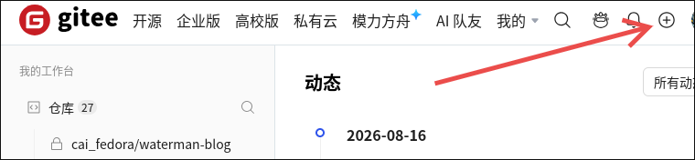
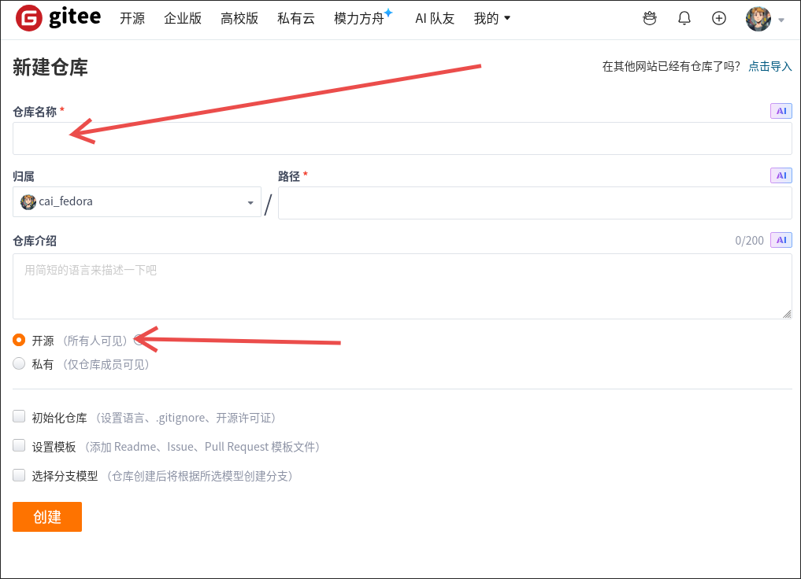
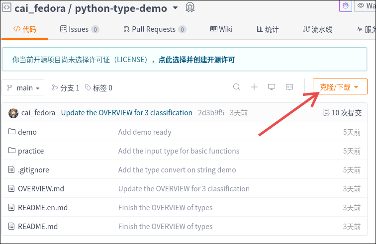
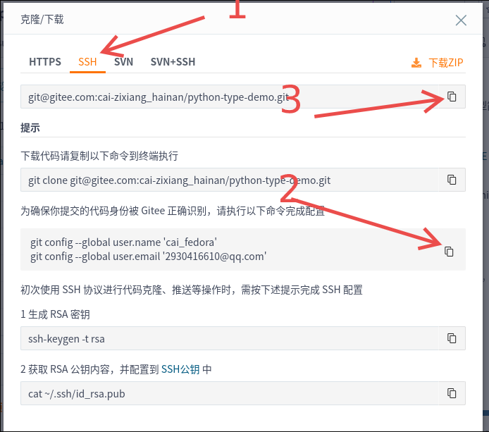

+++
date = '2026-08-17T12:54:10+08:00'
draft = true
title = 'Git_begin'
+++

# Git 入门

我们这里就不介绍 `git` 有什么用处了， 直接实操
注意这里演示的是 类 `Unix` (也就是Linux, wsl, macOS) 下的操作
当然如果你在 windows 下可以先装一个 [`Git Bash`](https://git-scm.com/install/windows)
然后打开 git bash 进行相同的操作

## 安装 Git

```bash
# ubuntu 直接用 apt装
sudo apt install git -y
```

## 创建你的项目目录

```bash
# 进入你存放代码的地方, 我这里使用 WORK
cd WORK 

# 创建一个 名为 python-learn 的目录, 这里作为演示
mkdir python-learn 
```

## 初始化

```bash
git init
```

这一步会创建一个 .git/ 目录在当前的目录， 它会存放我们每一次的提交

## 关联远程仓库 (可选)

远程仓库可以帮助我们将本地的代码推送到云端
就算你这台电脑数据灰飞烟灭代码也不会丢，以及让其他人可以下载和查看你的代码

先使用你的[gitee](https://gitee.com)或者[github](https://github.com)账号来创建仓库

gitee 端的操作
这里点击 `+` 然后选择新建仓库



之后会出现这个界面
填写仓库名称
然后选择开源即可(除非你的代码非常有价值并且你不希望别人看到)



github 端也是完全一样的， 换成英文而已，这里不重复了

之后需要配置一个 `ssh` 公钥.
如果你已经配置好可以直接跳过
如果尚未配置可以参考 [gitee 官方教程](https://help.gitee.com/base/account/SSH%E5%85%AC%E9%92%A5%E8%AE%BE%E7%BD%AE)

之后打开你刚才创建好的仓库
然后会有清晰的教程，但是在配置远程仓库的时候， 我们应该选择 `ssh` 来进行免密认证

首先在仓库这边点击克隆



之后点开 `ssh`



逐步执行上面的 1 和 2 的步骤, 注意2需要在bash里面执行

之后将 3 复制的内容 粘贴到下面的命令后， 像这样

!!! 不要直接复制我的这个命令， 这是我的仓库
应该替换成你实际复制的

```bash
git remote add origin <仓库地址>
```

我这里的示例是(别直接复制这个， 换成你自己的仓库地址)

```bash
git remote add origin git@gitee.com:cai-zixiang_hainan/python-type-demo.git
```

## 添加并提交代码

接下来是写你的代码
写完之后三步走 `add -> commit -> push`

add 后面加上一个 . 表示当前目录
这一步是先准备交材料， 你可以使用 `git status` 命令查看与上一次的对比

```bash
git add . # 将当前的目录全部加入到暂存区
```

commit 是提交到 git 当中， 这样你就会拥有这个时刻的代码快照
这个时候会打开一个编辑器， 写点东西记录一下这次的更改做了什么

```bash
git commit
```

或者你可以使用 -m

```bash
git commit -m "这是第一次提交"
```

之后就是 push 到远程仓库
一般默认的是旧版的主分支 master, 后续根据需要改 main, 新手不太需要管这个

```bash
git push -u origin master
```

这样就成功将你的代码推送到云端了

## 下载代码

当你真的不幸丢了本地的代码或者希望同学下载你的代码的时候， 让同学打开你的仓库， 执行这个命令即可

```bash
git clone <仓库地址> 
```

这是个示例

```bash
git clone git@gitee.com:cai-zixiang_hainan/python-type-demo.git
```

这个时候就会得到一个新的目录， 里面就是你之前推送的代码
