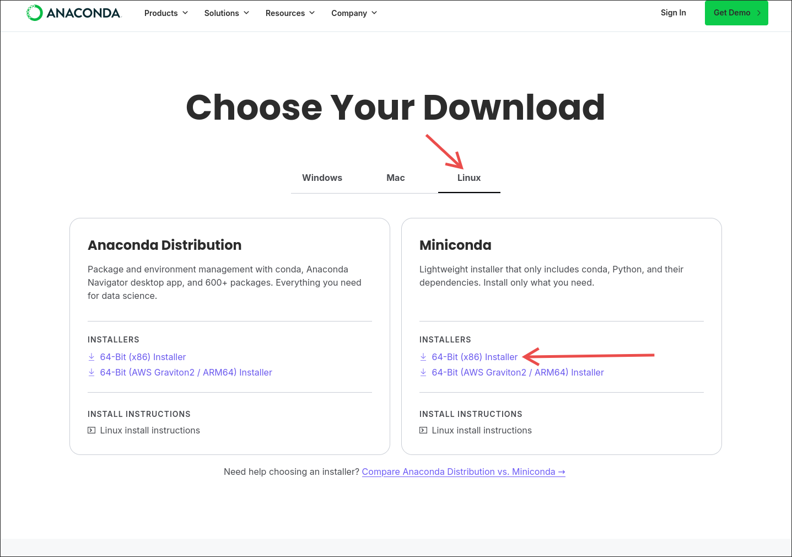

+++
date = '2026-08-15T19:35:27+08:00'
draft = true
title = 'Miniconda'
+++

# Miniconda

## 什么是Miniconda

相信不少人是因为自己需要学习人工智能，跑云端训练才学Linux
所以我在这里写了相关的内容，希望可以帮助到大家。

Anaconda 是一个 **Python的管理器**，让你在同一个操作系统上**拥有多个共存的Python环境，按需使用和激活**。
但是 Anaconda 预装太多东西，甚至达到几个G的体积，所以官方也推出了mini版 —— Miniconda。

Miniconda 跟Anaconda的最大区别就是砍掉了很多预装的东西，比如numpy之类的。
它的设计理念就是让用户按需安装，我是比较同意这个理念的，个人也一直在用Miniconda。

**下面的教程适用于Linux环境(包括原生Linux,WSL,虚拟机等)**

## 安装步骤

- 下载官方安装脚本
访问官方下载链接（<https://www.anaconda.com/download/success）>

选择 Linux，选择右边这个 Miniconda x86 版本 (大多数电脑都是x86, 但是macBook不是，在这之前确认自己的架构)。



- 使用bash执行脚本

```bash
# 首先需要把你的 Miniconda脚本放到Linux系统可以访问的地方

# 然后执行这个安装脚本
bash Miniconda3-latest-Linux-x86_64.sh
```

然后中间有引导，保持默认即可，叫你输yes你就yes回车。安装完之后重启终端或者使用下面的命令重新加载环境变量。

```bash
source ~/.bashrc
```

- 配置镜像源

很多同志连官方源不太流畅，推荐换成中科大。

访问这个链接进行配置即可： <https://mirrors.ustc.edu.cn/help/anaconda.html>

一般是创建一个 ~/.condarc 文件然后把 channels 开头的那些东西复制粘贴进去即可。

```bash
# 创建配置文件
touch ~/.condarc
# 然后编辑
nano ~/.condarc
```

- 配置pip源

我们很多时候还是使用 pip 来安装的，所以这里也需要配置一下pip的镜像源

访问这个网址进行配置 <https://mirrors.ustc.edu.cn/help/pypi.html>
**只需要执行设为默认的命令即可**, 剩下的不需要配置。

- 创建环境测试

```bash
# 这边的 -n 后面的是虚拟环境名, 这里既是 test-env. 然后后面可以指定python版本，根据实验需要来
conda create -n test-env python=3.12
```

- pip安装测试

```bash
# 先激活刚才创建的虚拟环境
conda activate test-env

# 然后装个 numpy 试试
pip install numpy
```

- 查看当前环境

```bash
conda env list
# 列出所有环境， 如果是当前的环境， 会标有 *
```
