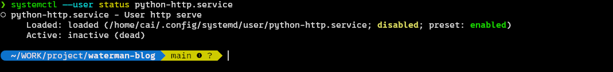
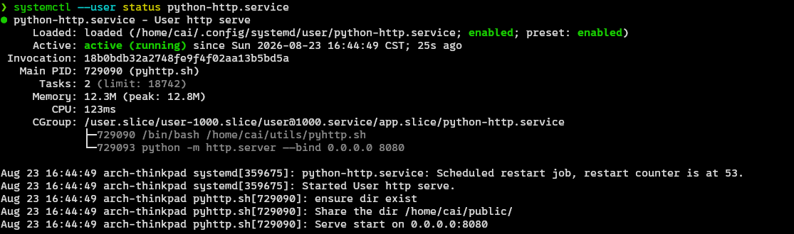

+++
date = '2026-08-23T15:25:11+08:00'
draft = true
title = 'Systemd_user_level'
+++

# Systemd 用户级别配置

> 参考链接
> [Linuxize](https://linuxize.com/post/how-to-create-a-systemd-service/)
> [arch wiki](https://wiki.archlinux.org/title/Systemd)

## 前言

`systemd` 在 Linux 中具有重要的地位， 整个操作系统都是运行在一个 pid=1 的 systemd 进程之下
比如说任何的日志， 图形化桌面，或者是平铺窗口管理器，都是 这个 pid=1 的进程的 `子进程`

当然也有一些发行版特地砍掉 systemd 而采用更加纯粹的解耦结构。但是绝大多数发行版都是以来systemd的

而systemd的进程跟普通进程的最大区别就是， 它们是后台静默运行的， 然后所有的 标准输出都会被`logd` 接管， 而不是直接打印到终端.

因而 它对于我们做一些自动化的事情，减少重复，统一管理是非常有帮助的
我们一般常用的 服务端的 nginx apache等也都提供了systemd服务

对于普通的桌面端用户，我们用的更多而是 用户级别的systemd服务
用户级别的服务不需要sudo权限， 可以防止误操作等.

**所以接下来我将会简单介绍一下如何自己动手配置一个简单的用户级别的服务**

## systemctl

我们一般使用 `systemctl` 这个 cli 来控制systemd的服务， systemctl 是 system contrl 的缩写。

以下是常用的命令， 我们在之后会用这些命令进行管理

| 效果 | 命令 |
| --- | --- |
| 重新加载 Unit File | `sudo systemctl daemon-reload` |
| 重新加载配置文件 | `sudo systemctl reload myservice` |
| 将该服务设置为开机自启动 | `sudo systemctl enable myservice` |
| 启动服务 | `sudo systemctl start myservice` |
| 设置为自启动并立刻启动 | `sudo systemctl enable --now myservice` |
| 查看服务的状态 | `sudo systemctl status myservice` |
| 停止服务 | `sudo systemctl stop myservice` |
| 停止开机自启动 | `sudo systemctl disable myservice` |
| 查看服务的日志 | `sudo journalctl -u myservice` |
| 查看实时日志 | `sudo journalctl -fu myservice` |

**上面的命令是系统级别的,对于用户级别的服务，我们将采用下面的命令**

首先去掉 `sudo` 然后再把 `systemctl` 改成 `systemctl --uer` 即可
`journalctl` 的操作也是如此

举个例子就是 `systemctl --user status myservice` 其他同理

---

## Unit File

我们会创建这样的一个配置文件
告诉 systemd 如何来启动和管理这个服务

```ini
[Unit]
Description=My Custom Application
After=network.target

[Service]
Type=simple
User=your_User
Group=your_User
ExecStart=%h/.local/bin/myapp.sh
ExecReload=/bin/kill -HUP $MAINPID
ExecStop=/bin/kill -TERM $MAINPID
Restart=on-failure
RestartSec=5

[Install]
WantedBy=multi-user.target
```

- **Unit**
  - **Description** 这是一个简单的描述，写一下这个服务是干嘛的即可
  - **After** 后面跟上依赖项, 这里的 `network.target` 表示这个 service需要网络正常启动才会启动

- **Service**
  - **Type** 类型， 默认是 `simple`， 这个类型不能创建子进程, 可选择的还有 `forking`, `onshot` 等. `forking` 可以创建子进程， onshot 则是用于执行一次则直接结束而不是在后台稳定运行的服务. 比如说 `nftables.service`。一般我们使用 `simple` 即可
  - **ExecStart** 这是我们使用 systemctl start 的时候会自动执行的命令, 用来规定服务如何启动. **需要注意的是我们需要使用绝对路径而不是相对路径**
  - **User** 和 **Group** 则是规定这个进程的归属用户和组, 使用你自己的用户名即可
  - **ExecReload** 这里规定了我们执行 systemctl reload 之后的操作或者行为
  - **ExecStop** 相信你也可以才到这是 执行 systemctl stop 的行为
  - **Restart** 以及 **RestartSec** 规定服务因为失败而重新尝试启动的配置, 一般使用上面的这个参数即可，请阅读参考链接进一步了解

- **Install**
  - **WantedBy** 这个规定了这个服务应该在什么时候启动， 当 ... 的时候， 启动这个服务.常见选项有 `multi-user` `graphical.target` `default.target`.

> multi-user 是服务器常用的, 当我们配置**系统级别的** systemd 服务的时候, 采用这个<br>
> graphical 则是桌面常用的，表示当这个系统有图形化界面启动的时候， 自动运行这个服务<br>
> default 则是用户级别的服务常用的，当我们配置用户级别的服务时，使用这个即可<br>

这里的 %h 是用户家目录的意思， 因为我们在 Unit File 里面没有shell环境， 也就没有 $HOME 这个环境变量， 所以我们需要指定家目录的时候需要使用这种猎奇语法 (当然你直接写绝对路径也没啥问题)

---

## Example

一般来说， 我们重点准备 `ExecStart` 中需要进行自动化的命令即可, 其他的直接照抄
然后对于一条命令就可以启动的服务，我们直接写相应的启动命令
对于需要一系列需要前置准备的任务， 我们一般写一个 bash 脚本(当然其他脚本也可以) 来规定启动的流程 (需要注意的是我们需要加上可执行权限)

这里举一个完整的例子, 我们需要实现每次开机都自动使用 python 启动一个简单的 http 服务暴露某个目录

### Start Script

- 编写一个可以执行的脚本

```bash
mkdir -p ~/utils 
# 可以创建一个目录来放自己常用的工具脚本
# 当然你可以直接放在 ~/.local/bin/ 下面或者任何你喜欢的地方

touch ~/utils/pyhttp.sh
```

往 `~/utils/pyhttp.sh` 中写入下面的内容(仅作演示)

```bash
#!/bin/bash
# 暴露的 ip和端口
IP="0.0.0.0"
PORT="8080"

# 服务暴露的目录
SERVE_PATH=$HOME/public/

echo "Serve start on ${IP}:${PORT}"

echo "ensure dir exist"
mkdir -p "$SERVE_PATH"

echo "Share the dir ${SERVE_PATH}"
cd "$SERVE_PATH"

echo "starting http server"
python -m http.server "$IP" --bind "$PORT"
```

- 创建 Unit File 放在用户级别的目录下 (`~/.config/systemd/user/`)

```bash
mkdir -p ~/.config/systemd/user 

touch ~/.config/systemd/user/python-http.service
```

写入内容 (记得把 cai 替换成你正在使用的用户名)

```ini
[Unit]
Description=User http serve
After=network.target

[Service]
Type=simple
User=cai
Group=cai
ExecStart=%h/utils/pyhttp.sh
ExecReload=/bin/kill -HUP $MAINPID
ExecStop=/bin/kill -TERM $MAINPID
Restart=on-failure
RestartSec=5

[Install]
WantedBy=default.target
```

- 重新读取文件并尝试启动

```bash
# 因为systemd 会将所有的 Unit File都直接加载到内存中
# 所以我们要让systemd看到我们新的配置文件， 需要使用命令重载
systemctl --user daemon-reload

# 尝试查看状态
systemctl --user status python-http # serve 的名称就是 Unit File 的名称去掉 后缀
```



我们可以看到这个状态是 loaded 表示systemd已经看到 配置文件
`disabled` 表示开机不会尝试启动
`inactive` 表示现在尚未运行

- 启动程序

**要记住 bash脚本需要添加执行权限才可以直接当成命令运行**

```bash
# 添加权限
chmod +x ~/utils/pyhttp.sh

# 设置为开机自启动并现在就启动
systemctl --user enable --now python-http

# 再次查看状态
systemctl --user status python-http
```

这一次你就会看到正常服务正常启动了



- 测试检验

```bash
echo "hello systemd" > ~/public/index.html
```

然后打开浏览器访问 `http://localhost:8080/`
应该会顺利看到写入的内容

---

## Clear

执行下面的命令销毁练习证据

关闭启动启动并停止

```bash
systemctl --user disable --now python-http
```

删除脚本

```bash
rm -f ~/utils/pyhttp.sh
```

删除 Unit File (建议留着当模板用)

```bash
rm -f ~/.config/systemd/user/python-http.service
```

---

恭喜你学会了如何手动配置一个用户级别的 systemd 服务
如果你的 脚本功底很强， 相信你可以完成一些非常高效的自动化

进一步学习， 可以参考

> [Linuxize](https://linuxize.com/post/how-to-create-a-systemd-service/)
> [arch wiki](https://wiki.archlinux.org/title/Systemd)
