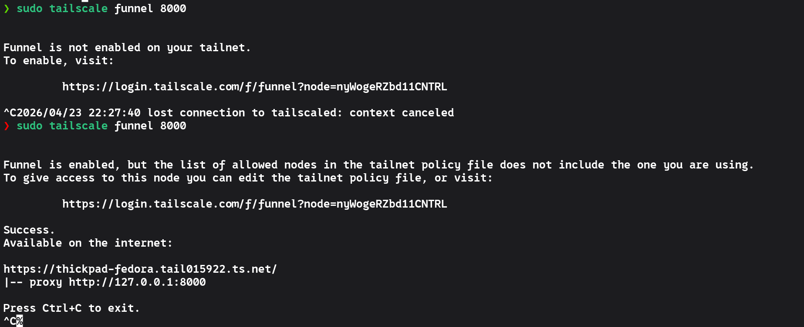
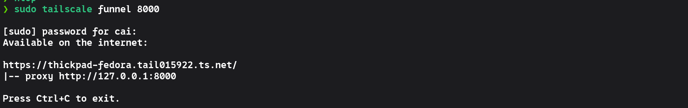

+++
date = '2026-04-23T22:47:38+08:00'
draft = true
title = 'Tailscale_funnel'
+++

# Tailscale Funnel

> 超级黑科技

- 不需要复杂的反向代理配置

- 不需要花钱注册域名

- 不需要进行备案

- 不需要任何的公网ip

- **直接把自己的服务免费搬上公网**

> 这个是tailscale 的 beta 服务, 也就是还在测试阶段， 现在完全免费， 跑满带宽

---

## 基本介绍

> tailscale funnel 并不是自己起一个服务， 它的作用是反向代理

- 什么是反向代理 ?
  
  >  反向代理就是不暴露服务器真实端口的一种手段， 客户端只需访问特定的域名， 反向代理的服务就会把流量转发到对应的端口, 也就是起一个中间人的作用. 比如 https 的端口固定在443, 却可以实现很多服务， 本质上就是反向代理在工作, 比如反向代理中的规则是 /api -> 8000, 也就是客户端访问 域名/api， 之后， 就会向服务器上的8000端口发送请求并处理业务逻辑

- tailscale funnel 需要什么条件才能起作用 ?
  
  > 你的服务器端口(即使没有公网ip也行)必须要在监听状态， 为了实现这一点， 你可以使用诸如 python, node 或者其他的方法, 这里介绍最容易的python (毕竟所有的linux都自带)

```bash
# 这里做一个静态路径托管的实例

# 来到你需要托管的目录路径下 常用的是 /var/www/html/ 但是你可以在任何一个地方起服务
cd path/to/your/dict/

python -m http.server 8000 # 开放8000端口暴露当前目录下的文件, 也就是静态托管
```

> 这里做完之后， 我们就可以通过 http://localhost:8000/ 来访问这个文件夹下的东西了， 如果你有index.html 的话， 会直接显示相应内容

- tailscale funnel 如何启动 ?
  
  > 你需要先进行两个认证
  
  ```bash
  # 直接输入这个命令， 如果尚未认证会自动弹出 网址让你认证， 你直接 ctrl 然后鼠标点就可以了
  sudo tailscale funnel 8000
  ```

>  认证完成之后应该没有任何变化， 这个时候 ctrl + c中断这个命令， 重新执行, 直到所有认证完成

**你会看到这样的画面, 这没有问题**


- 当你做完所有的认证再次重启服务之后， 你会看到这样的画面(注意这个过程中不要关掉python的http本地服务)



> 这里带https协议的这个网址， **全世界都可以访问**, 当然前提是你的python后端没有问题

## 进阶用法

- 后台静默运行(当然也可以使用tmux来替代， 只是这个自带的参数比较简单)
```bash
sudo tailscale funnel --bg 8000 # 在后台代理8000这个端口， 关掉这个终端之后， 服务不会终止

需要注意的是， 你的python服务很可能会因为你关掉终端而终止， 所以如果你有长期跑服务的需求， **建议使用tmux来保住进程**

- 查看 tailscale funnel 状态
  
  ```bash
  # 如果你使用的是后台的运行的话， 这个还是很实用的
  sudo tailscale funnel status
  # 会显示你代理的端口和具体的https网址 
  ```

- 停止反向代理
  
  ```bash
  sudo tailscale funnel off
  ```

- 清空所有已经配置的规则
  
  ```bash
  sudo tailscale serve --reset
  ```

- **路径转发** (最常用)
  
  ```bash
  # 制定转发规则
  sudo tailscale serve /api http://localhost:8080
  sudo tailscale serve / http://localhost:3000
  # 开启公网的服务
  sudo tailscale funnel on
  ```

> 这个时候， 别人可以通过你的网址加上路径来访问不同端口的服务

## 两大原则

- Funnel 必须指向本地运行的端口
- 必须先启动服务， 再开Funnel

## 日常三步走

- 开启python或者其他的端口监听服务
  
  ```bash
  建议用 tmux 保住服务
  
  # tmux
  
  python -m http.server 8000 --bind 127.0.0.1 # 这里建议绑定 回环防止直接暴露端口到局域网
  ```


- 开启funnel

```bash
sudo tailscale funnel 8000 # 反向代理8000端口
```


- 查看公网地址
  
  
  
  ```bash
  sudo tailscale status
  ```
