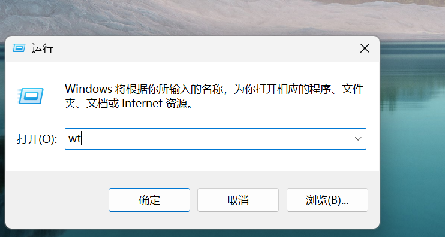
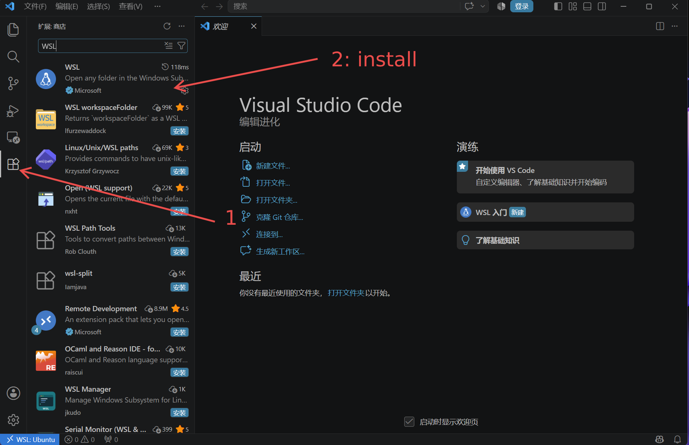
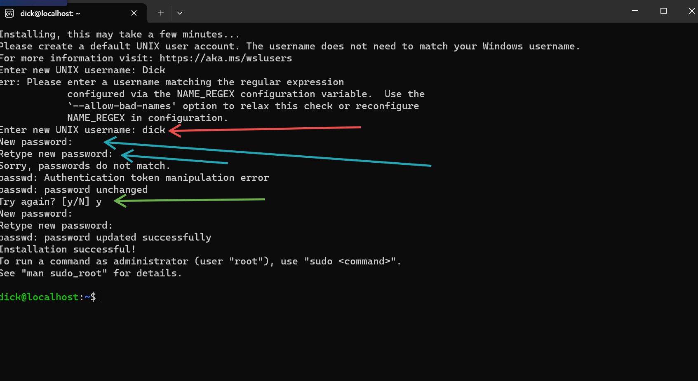
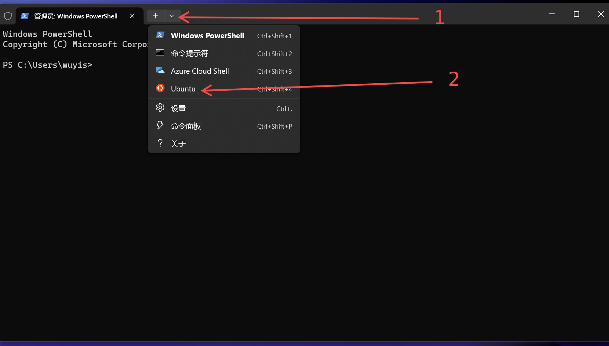
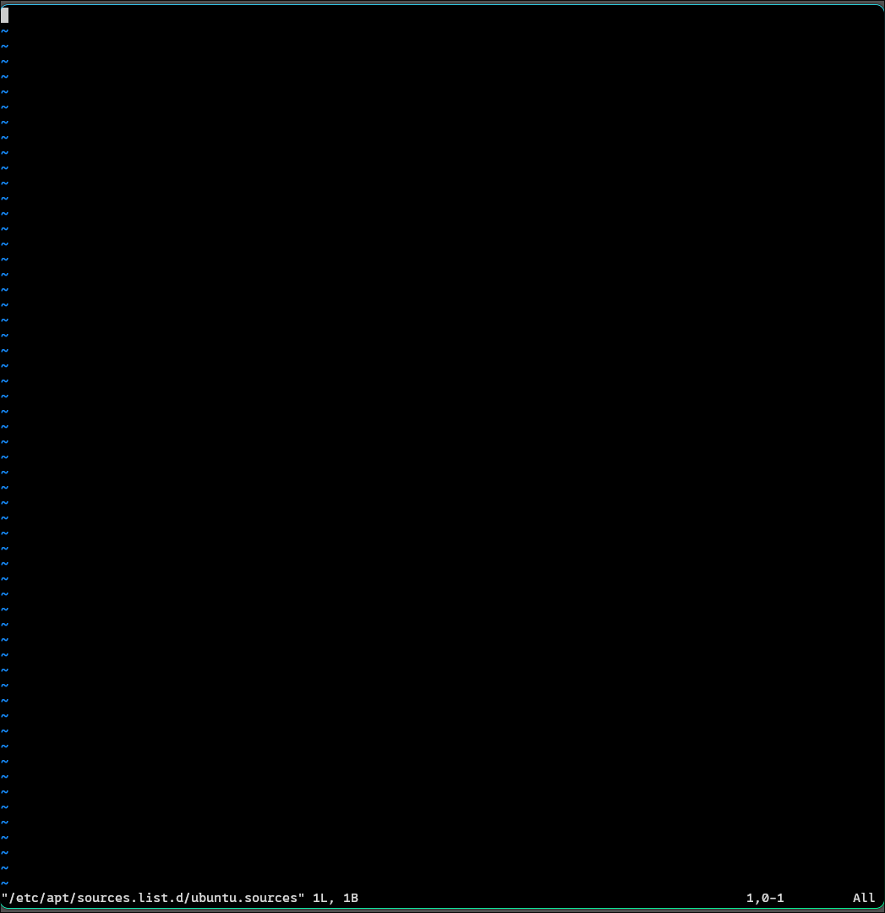
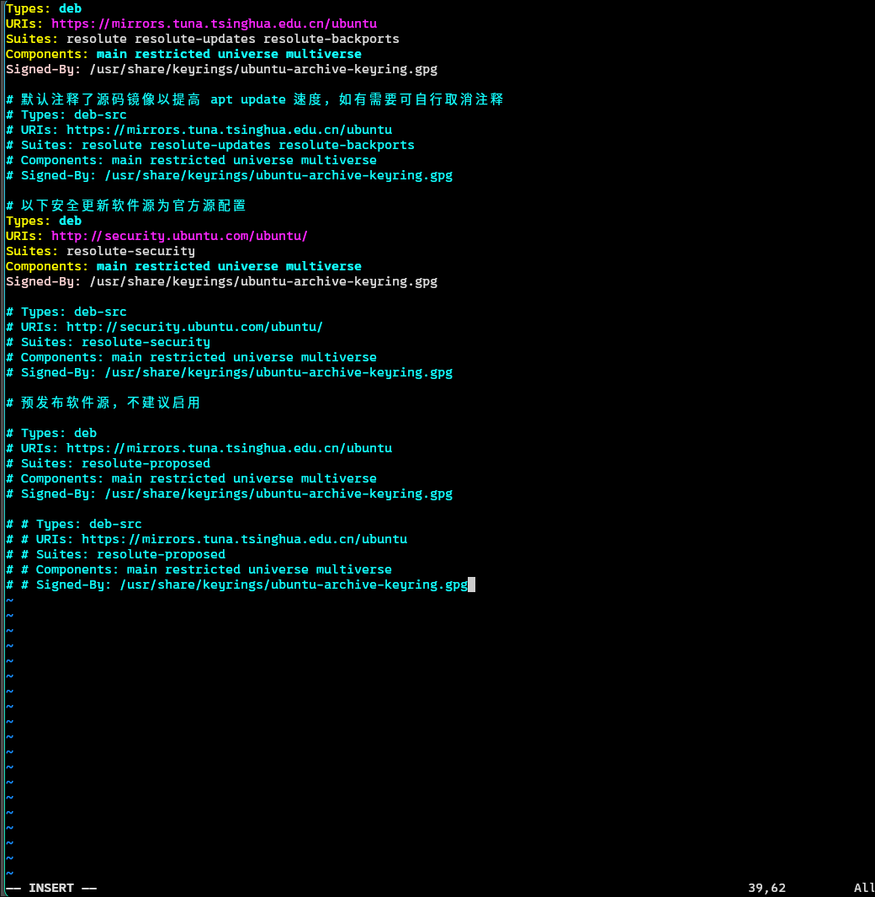
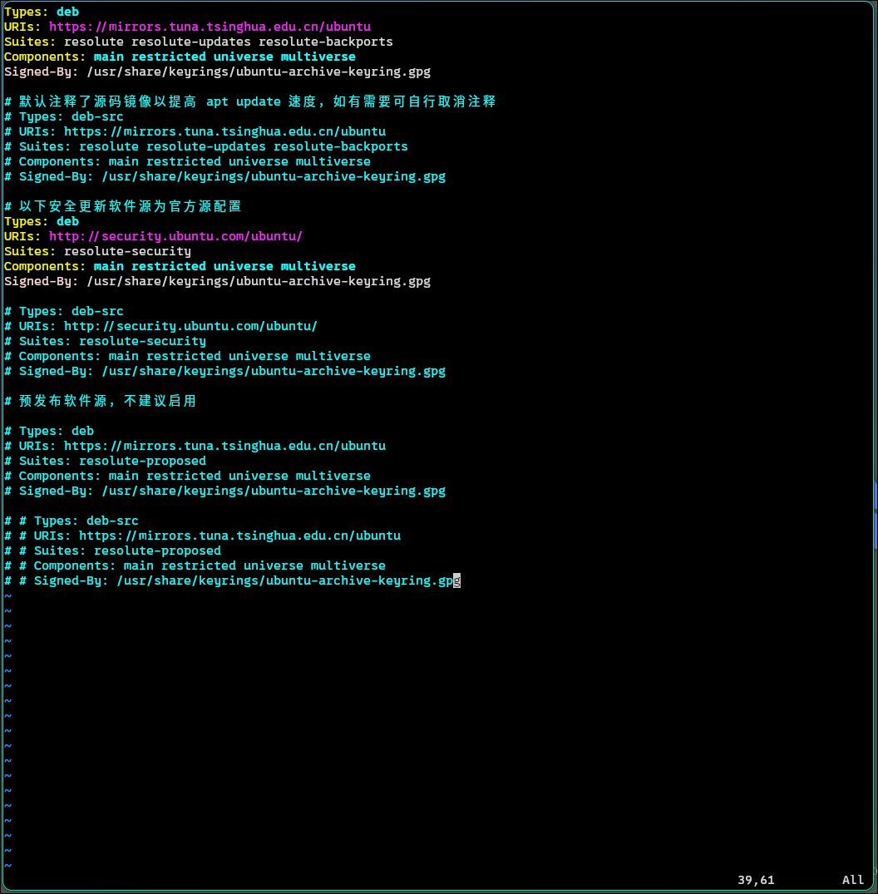
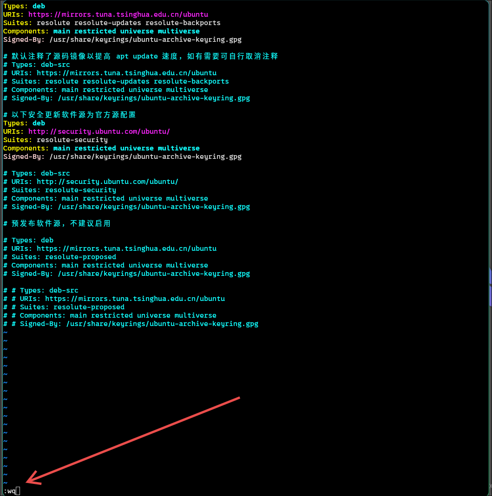

+++
date = '2026-08-04T12:24:48+08:00'
draft = true
title = 'Wsl_python_vscode'
+++

# WSL python 开发环境

`wsl` 的本质是跑在windows上的一个高性能的 Linux 容器
它的开发工具链完整, 并且支持原生Linux的几乎所有命令, 可以让我们获得更好的开发体验
并且 wsl 里面运行 python 的速度也比windows原生要快， 管理各种软件和工具也非常方便
并且 windows + wsl 的工作流是行业内成熟的方案, windows 也因为推出 wsl 而受到开发者的肯定

所以我会分享一下如何通过 wsl 搭建一个 python 开发环境

---

## 安装 WSL

同时按 `win`, `r` 之后会弹出一个窗口, 输入 `wt`


这个时候同时按下 `ctrl`, `shift`, `enter`(也就是回车)
打开管理员模式的终端
如果跳出提示的话选择 `是`

下一步是把下面的命令粘贴进终端执行

```bash
wsl --install --web-download
```

这里一般需要很长的时间, 我们趁这个时候安装和配置一下vscode

这一步执行完成之后可能会提示需要重启， 然后中间如果跳出是否允许 xxx 修改驱动设备, **一定选择是**, 否则无法安装

---

先访问 [vscode 官方链接](https://code.visualstudio.com/) 安装
选择windows版本的安装包

之后正常安装

安装完成之后， 按下 win 键 输入 vscode 就会找到， 点击运行

然后下一步是安装一个扩展, vscode本身只是一个简单的编辑器， 扩展可以让它胜任各种编码任务

我们要安装一个 `wsl` 的扩展



先点击左侧的扩展案件， 然后搜索框搜索 `wsl` 选择第一个扩展进行安装
这个时候我们 vscode 的准备工作基本结束了

---

重启之后用上面的步骤再次打开终端, 运行下面的命令
这里选择下载 ubuntu-26.04 版本, 可以根据自己的需要调整， 但是一般来说这个即可

```bash
wsl --install -d Ubuntu-26.04
```

> 如果你想要查看可以下载哪些发行版, 可以使用下面的命令

```bash
wsl --list --online
```

---

安装完成之后, 会出现下面的这些提示


在 `Unix username:` 后面输入你的用户名然后回车(不要用中文)

之后会让你设置一个密码, 输入一个你可以记住的, 不建议太长, 这个wsl一般别人也连不到你

在设置的过程中 **默认不会有任何的显示, 所以你看到没有反应是正常的**, 输入完你的密码之后回车即可

设置完之后会有一次 `retype` 就是让你再输一次密码确认, 也是不会显示出来， 自己输完回车即可

如果输入错误的话， 会出现 `Try Again ?` 的提示, 输入 `y` 然后重新设置密码即可

---

顺利的话这个时候你已经成功进入了 Ubuntu 操作系统

然后我们关闭当前的这个窗口. 重新打开一个终端直接开 `Ubuntu`

首先启动终端， 跟上面的打开步骤一样
点一个向下的箭头



这个时候就成功打开了

这里需要更换一下镜像源

首先使用命令查看当前的系统版本 (在那个红色的终端里面执行)

```bash
cat /etc/os-release
```

查看第一行的输出
可能长这样
PRETTY_NAME="Ubuntu 24.04.1 LTS"
这里的 24.04 代表发行的时间

**进行下面的操作之前, 请将你的键盘调成英文模式, 否则会失败**

首先备份一下原来的文件

```bash
sudo cp /etc/apt/sources.list.d/{ubuntu.sources,ubuntu.sources.bak}
```

> 这里需要输入密码, 输入之前设置过的回车即可

然后清空文件

```bash
echo "" | sudo tee /etc/apt/sources.list.d/ubuntu.sources
```

使用 `vi` 打开文件

```bash
sudo vi /etc/apt/sources.list.d/ubuntu.sources
```

这个时候你会看到



然后按下键盘的 `i` 键进入插入模式, 左下角会出现一个 `INSERT`


然后用鼠标复制一下下面的内容

如果你是 `24.04` 复制这个

```bash
Types: deb
URIs: https://mirrors.tuna.tsinghua.edu.cn/ubuntu
Suites: noble noble-updates noble-backports
Components: main restricted universe multiverse
Signed-By: /usr/share/keyrings/ubuntu-archive-keyring.gpg

# 默认注释了源码镜像以提高 apt update 速度，如有需要可自行取消注释
# Types: deb-src
# URIs: https://mirrors.tuna.tsinghua.edu.cn/ubuntu
# Suites: noble noble-updates noble-backports
# Components: main restricted universe multiverse
# Signed-By: /usr/share/keyrings/ubuntu-archive-keyring.gpg

# 以下安全更新软件源为官方源配置
Types: deb
URIs: http://security.ubuntu.com/ubuntu/
Suites: noble-security
Components: main restricted universe multiverse
Signed-By: /usr/share/keyrings/ubuntu-archive-keyring.gpg

# Types: deb-src
# URIs: http://security.ubuntu.com/ubuntu/
# Suites: noble-security
# Components: main restricted universe multiverse
# Signed-By: /usr/share/keyrings/ubuntu-archive-keyring.gpg

# 预发布软件源，不建议启用

# Types: deb
# URIs: https://mirrors.tuna.tsinghua.edu.cn/ubuntu
# Suites: noble-proposed
# Components: main restricted universe multiverse
# Signed-By: /usr/share/keyrings/ubuntu-archive-keyring.gpg

# # Types: deb-src
# # URIs: https://mirrors.tuna.tsinghua.edu.cn/ubuntu
# # Suites: noble-proposed
# # Components: main restricted universe multiverse
# # Signed-By: /usr/share/keyrings/ubuntu-archive-keyring.gpg
```

如果你是 `26.04` 复制这个

```bash
Types: deb
URIs: https://mirrors.tuna.tsinghua.edu.cn/ubuntu
Suites: resolute resolute-updates resolute-backports
Components: main restricted universe multiverse
Signed-By: /usr/share/keyrings/ubuntu-archive-keyring.gpg

# 默认注释了源码镜像以提高 apt update 速度，如有需要可自行取消注释
# Types: deb-src
# URIs: https://mirrors.tuna.tsinghua.edu.cn/ubuntu
# Suites: resolute resolute-updates resolute-backports
# Components: main restricted universe multiverse
# Signed-By: /usr/share/keyrings/ubuntu-archive-keyring.gpg

# 以下安全更新软件源为官方源配置
Types: deb
URIs: http://security.ubuntu.com/ubuntu/
Suites: resolute-security
Components: main restricted universe multiverse
Signed-By: /usr/share/keyrings/ubuntu-archive-keyring.gpg

# Types: deb-src
# URIs: http://security.ubuntu.com/ubuntu/
# Suites: resolute-security
# Components: main restricted universe multiverse
# Signed-By: /usr/share/keyrings/ubuntu-archive-keyring.gpg

# 预发布软件源，不建议启用

# Types: deb
# URIs: https://mirrors.tuna.tsinghua.edu.cn/ubuntu
# Suites: resolute-proposed
# Components: main restricted universe multiverse
# Signed-By: /usr/share/keyrings/ubuntu-archive-keyring.gpg

# # Types: deb-src
# # URIs: https://mirrors.tuna.tsinghua.edu.cn/ubuntu
# # Suites: resolute-proposed
# # Components: main restricted universe multiverse
# # Signed-By: /usr/share/keyrings/ubuntu-archive-keyring.gpg
```

点一下终端把焦点重新回到 wsl, 之后同时按住 `ctrl`, `shift`, `v` 进行粘贴
会出现下面这样的


然后按 `Esc` 键， 也就是键盘最左上角的那个, 然后**左下角的**`INSERT` 会消失



之后打出 `:wq`  会自动出现在左下角, 如果没有出现请检查是不是误用了中文输入法



然后回车就成功退回终端了

---

下一步是更新一下 ubuntu内部的软件

```bash
sudo apt update # 更新索引

sudo apt upgrade -y # 更新软件
```

---

接下来先创建一个目录存放你的 python 代码， 比如说我这里新建一个 python-learn

```bash
mkdir python-learn

# mkdir <你要创建的目录名>
```

进入目录

```bash
cd python-learn

# cd <你要进入的目录名>
```

创建一个新的 python 脚本

```bash
touch hello.py

# touch <你要创建的文件名>
# python 脚本以 .py 作为后缀
```

使用 vscode 打开当前目录

```bash
code .

# vscode 就是这里的 code 命令， . 表示当前目录
```

---

剩下的内容可以直接参考 [linux-python入门教程](https://hb.linuxcabin.top/applications/programming/python/)

---

也可以参考 [bilibili 教学视频](https://www.bilibili.com/video/BV1GCj4zdEsP?t=565.5)
