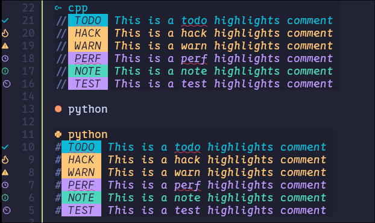

+++
date = '2026-05-05T13:17:29+08:00'
draft = true
title = 'Config Lazyvim'
+++

# Lazyvim 插件

> 我把所有的常用插件配置都打包好了， 使用脚本一键安装， 不需要任何的翻墙和配置， 打开就用, 当然还是需要手动配置字体的， 具体参见 [nerd-font-config](https://www.waterman.xin/repo/nerd-font/)

```bash
bash <(curl -fsSL https://repo.waterman.xin/configs/lazyvim/config.sh)
```

关于入门使用可以查看 [LazyVim入坑视频](https://www.bilibili.com/video/BV1TJCvYFE2T?t=286.5)

> 这里只介绍一些 lazyvim 特有的内容， 基础的 `vim` 键位可以参考其他资源

## 常用快捷键

- `<Leader>`

`<Leader>` 是一个特殊的入口键  
默认配置下, `<Space>` 也就是空格即 `<Leader>`  
下面的操作都是顺序操作  
也就是先按前面的键再按后面的  
比如说 `<Leader>e` 就是先按空格再按 e

- Buffer

就是最上方显示的不同文件， 我们可以方便的使用快捷键进行切换
只有当你同时打开多个文件的时候才会显示

> [!NOTE]
> 约定, C-c 为 ctrl c, 同理 C-/ 为 ctrl 和 / 一起按

### 普通模式快捷键

| 快捷键 | 效果 |
| --- | --- |
| `<Leader>e` | 打开(或者关闭)当前项目根目录的结构 |
| `<Leader><Leader>` | 根据文件名进行搜索 |
| `<Leader>ff` | 根据文件名进行搜索 |
| `<Leader>/` | 搜索文件当中的内容(根目录递归) |
| `:LazyExtra` | 打开扩展配置 |
| `C-/` | 打开(关闭)终端 |
| `<Leader>gl` | 打开 git log |
| `H` | 切换到左边的 Buffer |
| `L` | 切换到右边的 Buffer |
| `<Leader>wH` | 切换焦点到左边的窗口 |
| `<Leader>wL` | 切换焦点到右边的窗口 |

有一些特殊的不方便放到表格当中， 但是也挺实用的， 这里介绍一下

- `<Leader>`  `  (也就是键盘左上角的反引号), 切换到上一个 Buffer
- `<Leader>`  |   进行垂直分屏
- `<Leader>` -   进行水平分屏

### 目录预览快捷键

当我们的焦点处于用 `<Leader>e` 打开的目录预览窗口的时候， 可以使用一些快捷键对文件和目录进行快捷操作

| 快捷键 | 效果 |
| --- | --- |
| `a` | 添加一个文件或者目录 |
| `r` | 重命名一个文件或者目录 |
| `d` | 删除一个目录或者文件 |
| `y` | 复制一个文件 |
| `p` | 将刚才复制的文件粘贴到现在所处的位置 |

## 注释

lazyvim 对于注释有特殊的处理， 这让视觉效果特别好
个人很推荐使用

使用的方法就是在注释后面写 `关键词:`

举个例子

- cpp

```cpp
// TODO: This is a todo highlights comment
// HACK: This is a hack highlights comment
// WARN: This is a warn highlights comment
// PERF: This is a perf highlights comment
// NOTE: This is a note highlights comment
// TEST: This is a test highlights comment
```

- python

```python
# TODO: This is a todo highlights comment
# HACK: This is a hack highlights comment
# WARN: This is a warn highlights comment
# PERF: This is a perf highlights comment
# NOTE: This is a note highlights comment
# TEST: This is a test highlights comment
```

效果图



希望可以给你带来帮助, 欢迎来到 `lazyvim`
